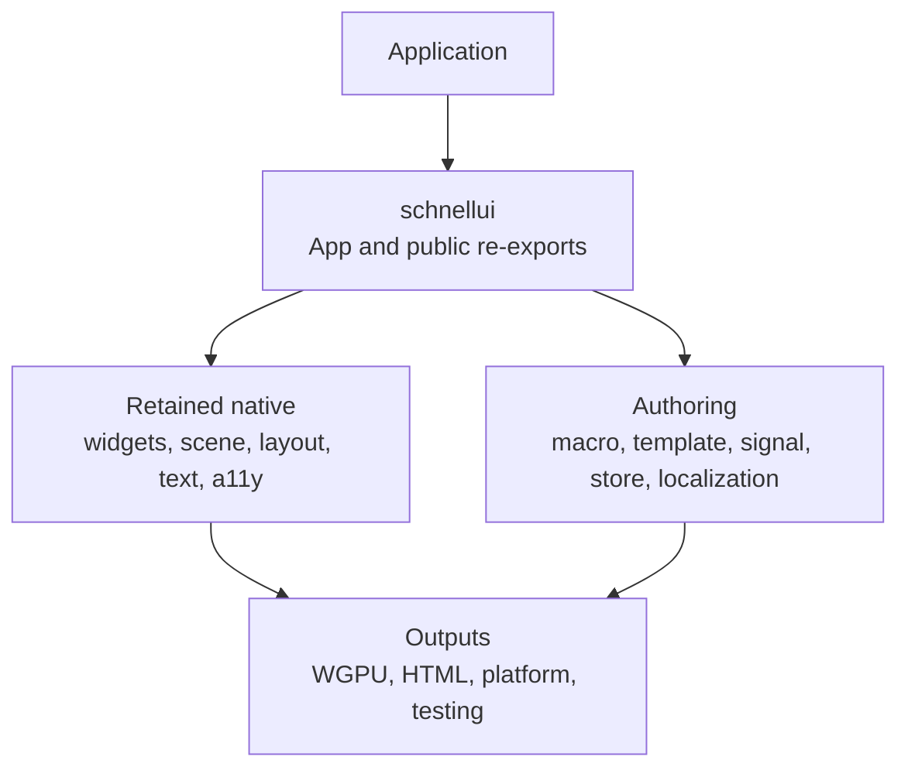
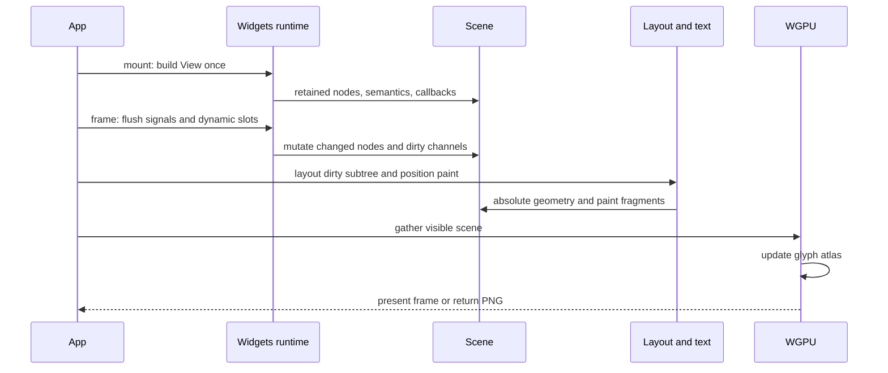
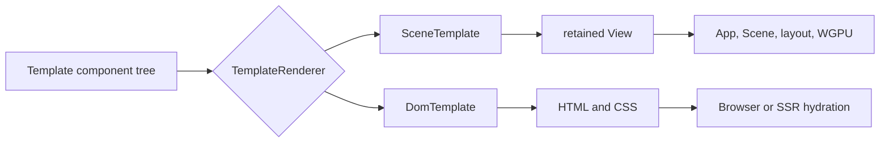
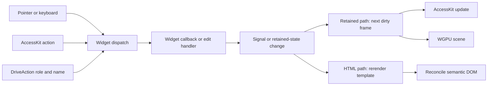

# SchnellUI architecture

SchnellUI has two complementary UI paths:

- A retained native path: build a `View` tree once, then update the retained scene
  incrementally and render it with WGPU.
- A renderer-generic path: express components as `Template` values and render the
  same value either into the retained tree or into semantic HTML.

The umbrella [`schnellui`](../crates/schnellui/src/lib.rs) crate is the application
boundary. It re-exports the public building blocks and owns the native runtime.



## Workspace layers

The crates are deliberately separated by responsibility rather than by widget:

| Layer | Crates | Responsibility |
| --- | --- | --- |
| Authoring | [`schnellui-macro`](../crates/schnellui-macro), [`schnellui-view-parser`](../crates/schnellui-view-parser), [`schnellui-template`](../crates/schnellui-template), [`schnellui-signal`](../crates/schnellui-signal), [`schnellui-store`](../crates/schnellui-store), [`schnellui-localization`](../crates/schnellui-localization) | `view!` parsing/code generation, renderer-neutral component values, local signals, selector-backed shared state, messages. |
| Retained model | [`schnellui-widgets`](../crates/schnellui-widgets), [`schnellui-scene`](../crates/schnellui-scene), [`schnellui-layout`](../crates/schnellui-layout), [`schnellui-text`](../crates/schnellui-text) | Builds widgets into a retained scene; computes geometry, shapes text, and keeps interaction callbacks. |
| Native integration | [`schnellui`](../crates/schnellui), [`schnellui-render-wgpu`](../crates/schnellui-render-wgpu), [`schnellui-platform`](../crates/schnellui-platform), [`schnellui-a11y`](../crates/schnellui-a11y) | App lifecycle, GPU presentation, window events, and AccessKit trees. |
| Alternative output and support | [`schnellui-render-html`](../crates/schnellui-render-html), [`schnellui-testing`](../crates/schnellui-testing), themes, icons, charts, Servo | DOM/CSS rendering, scenario testing, and optional domain integrations. |

`schnellui-store` is a signal-backed façade for shared application models: a
`Store<T>` owns the state, while `Selector` values expose equality-gated derived
projections to the existing reactive graph. Retained dynamic widgets attach
callback-free subscriptions to that graph, so a frame evaluates only producers
whose tracked projection may have changed; the `!Send` producer and all scene
mutation remain owned by the app-local widget runtime.

Examples are workspace members too; start with [`hello`](../examples/hello/src/main.rs),
[`counter`](../examples/counter/src/main.rs), and
[`html_native`](../examples/html_native/src/main.rs).

## Retained native runtime

`App::mount*` calls `View::build` once. The resulting widgets populate an app-owned
runtime (callbacks and dynamic slots) and a retained [`Scene`](../crates/schnellui-scene/src/lib.rs).
Later frames do not rebuild the whole view: signal effects and dynamic slots mutate
the affected scene data and dirty channels identify the work to perform.
`view!` expands to ordinary typed widget-builder chains (including `Text::dynamic`
closures where needed); its static parts are built at mount, without a separate
compile-time hoisting guarantee.

Normal reactivity updates existing nodes rather than diffing a virtual DOM. A tree-
shape change is explicit: replace a referenced subtree with `App::replace_subtree`,
or use one of the windowed remount/update hooks in
[`structural_update`](../crates/schnellui/src/structural_update.rs).

```rust
use schnellui::{view, App};
use schnellui::widgets::View;

fn ui() -> impl View {
    view! { column { text { "Hello, schnellui" } } }
}

let mut app = App::mount_with_size(ui(), 400, 160);
app.frame();
app.render_to_png("hello.png")?;
```

Behind the scenes, the first frame synchronizes the layout graph; subsequent frames
only relayout when layout data is dirty. WGPU gathers the current visible retained
scene for presentation and uses incremental glyph-atlas texture updates, including
the headless PNG readback path.



The implementation of this pass is [`App::settle_frame`](../crates/schnellui/src/lib.rs),
and the retained widget-to-scene construction lives in
[`schnellui-widgets`](../crates/schnellui-widgets/src/lib.rs).

## The `Template` renderer seam and HTML

[`Template`](../crates/schnellui-template/src/lib.rs) is a statically typed component
value. Its `render` method accepts a `TemplateRenderer`, whose associated `Node` is
chosen by the backend. Component defaults, composition, semantics, and callback
ownership stay in `schnellui-template`; renderers only map them to native nodes.

The retained adapter is
[`SceneTemplate`](../crates/schnellui-widgets/src/template.rs): it returns `AnyView`,
which `App::mount_template` mounts normally. The HTML branch uses
[`HtmlRenderer`](../crates/schnellui-render-html/src/lib.rs) and `DomTemplate` to emit
semantic DOM and CSS—no canvas or translation of WGPU draw commands. Its optional
SSR/router support is in [`ssr`](../crates/schnellui-render-html/src/ssr.rs).

```rust
use schnellui::App;
use schnellui_template::{column, Button, Text};

let page = column()
    .child(Text::new("Template component"))
    .child(Button::new("Continue"));

// Native retained scene:
let app = App::mount_template(page);
```

Because a template value is consumed when rendered, create the template again (often
from a small view factory) when targeting more than one backend:

```rust
use schnellui_render_html::HtmlRenderer;
use schnellui_template::{column, Button, Text};

let document = HtmlRenderer::new(640, 360).render(
    column().child(Text::new("Template component")).child(Button::new("Continue")),
);
assert!(document.as_str().contains("Continue"));
```



The complete native-HTML gallery and its driven scenario are in
[`examples/html_native`](../examples/html_native/src/main.rs).

## One semantic model for input and accessibility

Widgets record roles, names, values, states, supported actions, and bounds in the
retained scene. [`schnellui-a11y`](../crates/schnellui-a11y/src/lib.rs) turns that
data into full or incremental AccessKit `TreeUpdate`s; the window host publishes
them to the platform accessibility adapter. The same retained widget id is used as
its AccessKit node id.

Pointer, keyboard, and assistive actions converge on the widget dispatch path.
For example, `App::dispatch_action` routes AccessKit `Click`, `SetValue`, scrolling,
focus, and slider adjustments to the same handlers used by native interaction. The
renderer-neutral `DriveAction` applies the same role-and-name targeting to both the
retained and HTML paths.

```rust
use schnellui::{a11y::Role, signal::create_signal, template::DriveAction, view, App};
use schnellui::widgets::View;

fn counter() -> impl View {
    let count = create_signal(0_i64);
    view! {
        column {
            text(role = Role::Status) { (count.get().to_string()) }
            button(on:click = move || count.update(|value| *value += 1)) { "Increment" }
        }
    }
}

let mut app = App::mount(counter());
assert!(app.drive_action(&DriveAction::click(Role::Button, "Increment")));
app.frame();
```



For an end-to-end retained example, the
[`counter`](../examples/counter/src/main.rs) example locates a button by role and
name, dispatches real `ActionRequest`s, then checks the accessibility tree.
